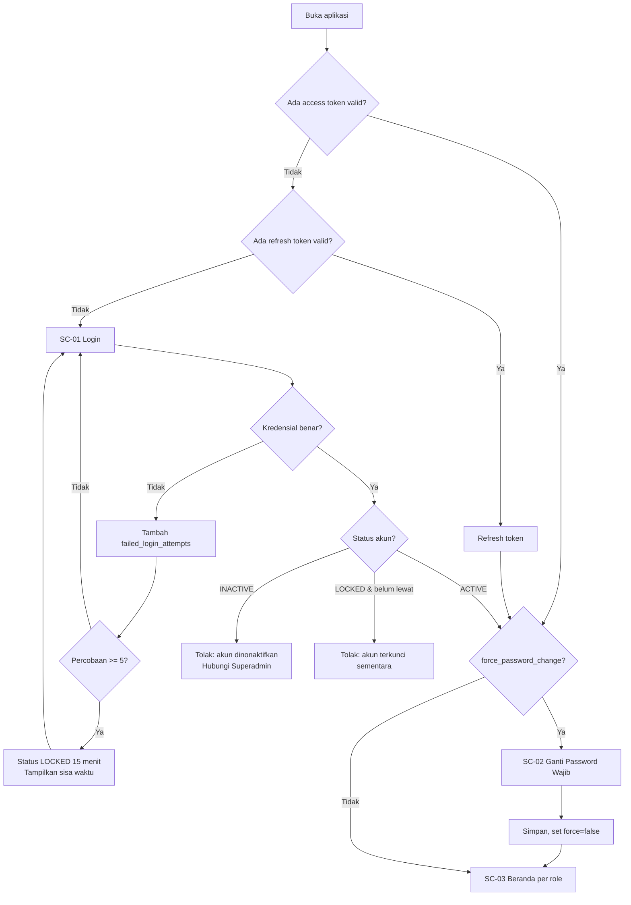
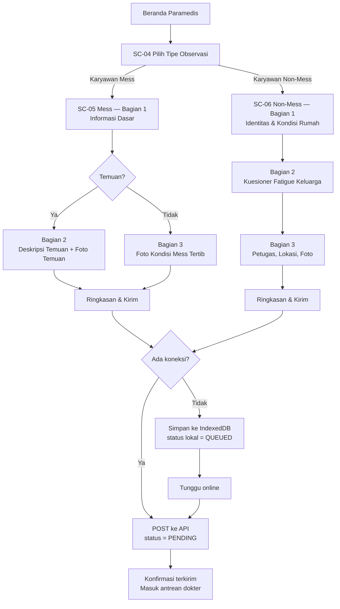
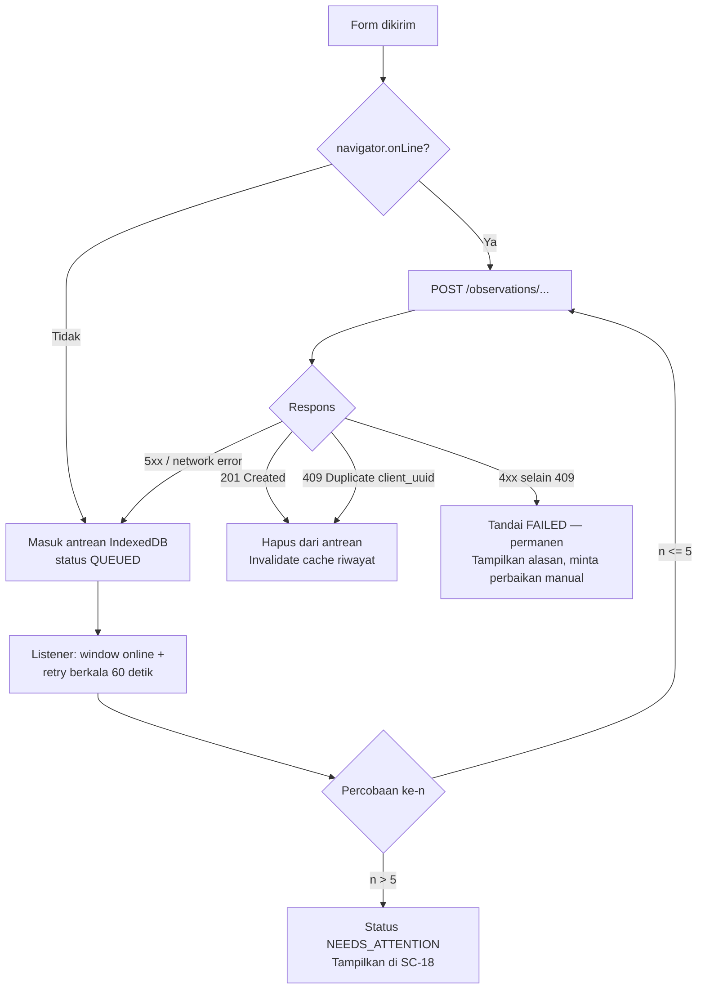
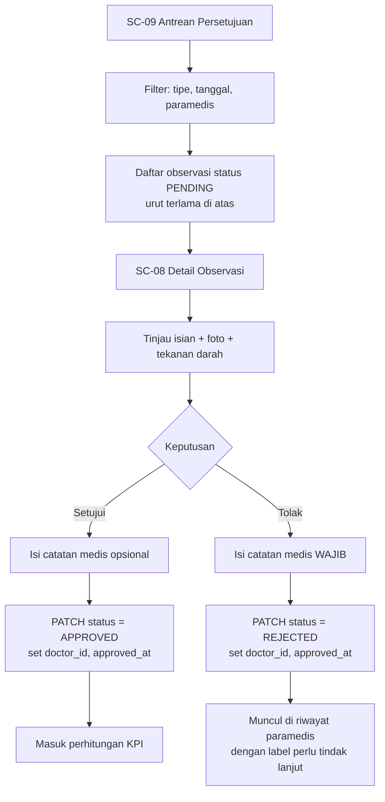
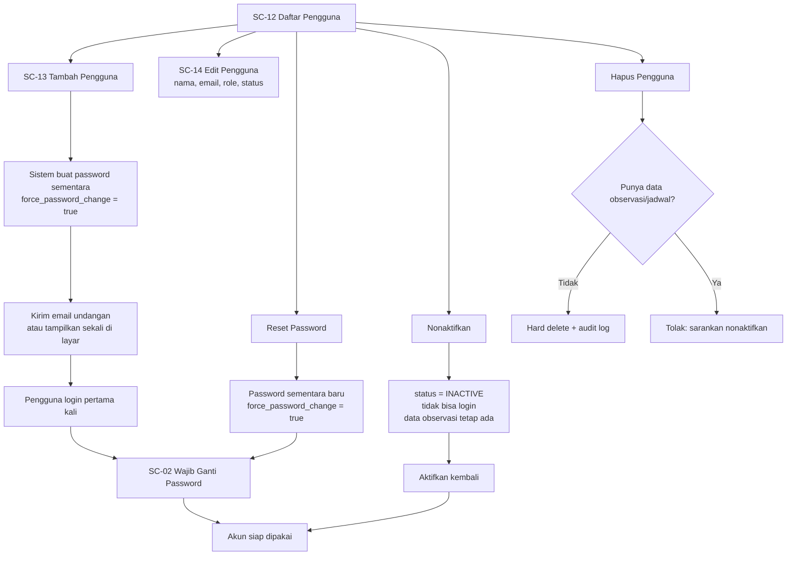
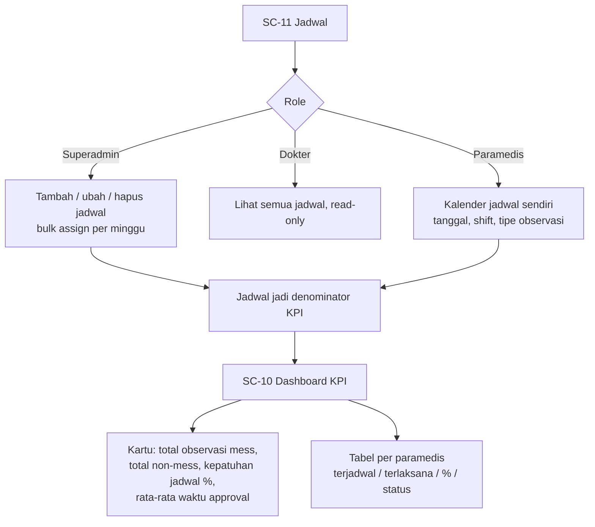
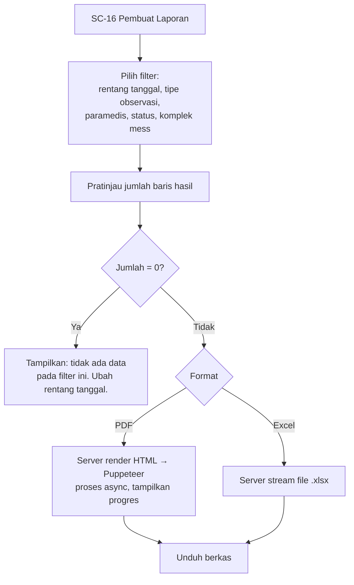

# 01 — User Flow

> Turunan dari 00_PRD.md. Menjadi masukan untuk 08_UI_GUIDE.md (wireframe) dan 09_COMPONENT.md.

---

## 1. Peta Layar (Screen Map)

Setiap layar punya ID `SC-xx` yang direferensikan di 06_TASK.md dan 08_UI_GUIDE.md.

| ID | Rute | Layar | Akses |
|---|---|---|---|
| SC-01 | `/login` | Login | Publik |
| SC-02 | `/ganti-password-wajib` | Ganti Password Wajib | Semua (force flag) |
| SC-03 | `/` | Beranda (dialihkan per role) | Semua |
| SC-04 | `/observasi/pilih-tipe` | Pintu Masuk Observasi | Paramedis |
| SC-05 | `/observasi/mess/baru` | Form Observasi Mess | Paramedis |
| SC-06 | `/observasi/non-mess/baru` | Form Observasi Non-Mess | Paramedis |
| SC-07 | `/observasi` | Riwayat Observasi | Semua |
| SC-08 | `/observasi/:type/:id` | Detail Observasi | Semua (scoped) |
| SC-09 | `/persetujuan` | Antrean Persetujuan | Dokter |
| SC-10 | `/kpi` | Dashboard KPI | Dokter, Superadmin |
| SC-11 | `/jadwal` | Jadwal Observasi | Semua (mode berbeda) |
| SC-12 | `/pengguna` | Daftar Pengguna | Superadmin |
| SC-13 | `/pengguna/baru` | Tambah Pengguna | Superadmin |
| SC-14 | `/pengguna/:id/edit` | Edit Pengguna | Superadmin |
| SC-15 | `/master/mess` | Master Data Mess | Superadmin |
| SC-16 | `/laporan` | Pembuat Laporan | Dokter, Superadmin |
| SC-17 | `/profil` | Profil & Ganti Password | Semua |
| SC-18 | `/antrean-sinkron` | Antrean Sinkronisasi Offline | Paramedis |
| SC-19 | `/pengaturan` | Pengaturan Sistem | Superadmin |
| SC-00 | `*` | 403 / 404 | Semua |

### Beranda per role (SC-03)

| Role | Diarahkan ke | Isi |
|---|---|---|
| Paramedis | Beranda Paramedis | Tombol besar "Mulai Observasi", jadwal hari ini, badge antrean sinkron, 5 observasi terakhir |
| Dokter | Antrean Persetujuan (SC-09) | Jumlah menunggu, observasi tertua, ringkasan KPI |
| Superadmin | Dashboard KPI (SC-10) | KPI semua paramedis, jumlah pengguna aktif, jumlah observasi bulan berjalan |

---

## 2. Navigasi Global

Bottom navigation (mobile) / sidebar (desktop ≥ `lg`), item ditentukan role:

```
PARAMEDIS   [ Beranda ] [ Observasi ] [ Jadwal ]  [ Profil ]
DOKTER      [ Persetujuan ] [ Observasi ] [ KPI ] [ Laporan ] [ Profil ]
SUPERADMIN  [ KPI ] [ Pengguna ] [ Observasi ] [ Jadwal ] [ Master ] [ Laporan ] [ Profil ]
```

Maksimum 5 item di bottom nav; sisanya masuk menu "Lainnya".

---

## 3. Flow Autentikasi



**Aturan tambahan**

- Login gagal selalu menampilkan pesan generik "Email atau password salah" — tidak membedakan email tidak ada vs password salah.
- Saat akun terkunci, pesan menyebutkan sisa menit agar pengguna tidak mengulang percobaan.
- SC-02 tidak bisa dilewati: seluruh rute lain redirect kembali ke SC-02 selama `force_password_change = true`.

---

## 4. Flow Observasi (Paramedis)



### Aturan navigasi form

- Form ditampilkan sebagai **stepper multi-langkah**, bukan satu halaman panjang. Satu bagian = satu layar.
- Tombol "Lanjut" hanya aktif jika field wajib di bagian tersebut valid.
- Tombol "Kembali" mempertahankan isian (state disimpan di form context + autosave draft ke IndexedDB setiap 3 detik).
- Perubahan Temuan Ya→Tidak setelah Bagian 2 terisi: tampilkan konfirmasi bahwa data Bagian 2 akan dihapus.
- Layar "Ringkasan & Kirim" menampilkan seluruh isian read-only dengan tombol edit per bagian.
- Setelah terkirim, draft di IndexedDB dihapus.

### Autosave & pemulihan draft

Jika paramedis menutup aplikasi di tengah pengisian, saat membuka SC-04 lagi muncul kartu:
"Ada observasi belum selesai — Mess A / 12, dimulai 14:32. [Lanjutkan] [Buang]"

---

## 5. Flow Offline & Sinkronisasi



**Aturan sinkronisasi**

- Setiap submission membawa `client_uuid` (UUID v4 dibuat di client). Server menolak duplikat dengan 409 dan mengembalikan record yang sudah ada — bukan error bagi pengguna.
- Foto disimpan di IndexedDB sebagai Blob hasil kompresi, diunggah bersama payload saat sinkronisasi.
- Badge di header menampilkan jumlah item antrean. Ketuk badge → SC-18.
- SC-18 menampilkan daftar antrean dengan status, waktu dibuat, jumlah percobaan, dan tombol "Coba kirim lagi" / "Hapus".
- Urutan pengiriman: FIFO berdasarkan waktu pembuatan.

---

## 6. Flow Persetujuan (Dokter)



**Aturan**

- Observasi berstatus APPROVED atau REJECTED **tidak bisa diubah lagi** oleh dokter mana pun. Perubahan hanya lewat pembatalan oleh Superadmin (Fase 3).
- Catatan medis wajib diisi saat menolak, minimal 10 karakter.
- Dokter tidak bisa menyetujui observasi yang ia buat sendiri (tidak relevan karena dokter tidak bisa membuat observasi, tapi guard tetap dipasang).

---

## 7. Flow Manajemen Pengguna (Superadmin)



**Aturan**

- Superadmin tidak bisa menonaktifkan, menghapus, atau menurunkan role akunnya sendiri.
- Sistem selalu menyisakan minimal satu Superadmin berstatus ACTIVE.
- Mengganti role pengguna yang sedang login memaksa refresh token dicabut — sesi lama tidak boleh membawa hak akses lama.

---

## 8. Flow Jadwal & KPI



Definisi kepatuhan jadwal ada di 10_BUSINESS_RULE.md (BR-KPI-01).

---

## 9. Flow Laporan



- Rentang tanggal maksimum satu laporan: 12 bulan.
- Laporan PDF di atas 200 baris diproses sebagai job async; pengguna menerima link unduhan saat selesai.

---

## 10. State Machine Observasi

```
              ┌──────────┐
   dibuat ───▶│  DRAFT   │  (lokal saja, belum pernah dikirim)
              └────┬─────┘
                   │ kirim
                   ▼
              ┌──────────┐   gagal kirim   ┌──────────┐
              │ QUEUED   │◀───────────────▶│  FAILED  │ (lokal)
              └────┬─────┘                 └──────────┘
                   │ berhasil POST
                   ▼
              ┌──────────┐
              │ PENDING  │  (tersimpan di server, menunggu dokter)
              └────┬─────┘
          ┌────────┴────────┐
          ▼                 ▼
    ┌───────────┐     ┌───────────┐
    │ APPROVED  │     │ REJECTED  │   (final, tidak bisa diubah)
    └───────────┘     └───────────┘
```

`DRAFT`, `QUEUED`, `FAILED` hanya ada di client (IndexedDB). Server hanya mengenal `PENDING`, `APPROVED`, `REJECTED`.

---

## 11. Penanganan Kondisi Khusus

| Kondisi | Perilaku |
|---|---|
| Token kedaluwarsa saat mengisi form | Simpan draft, tampilkan dialog login ulang, kembalikan ke form setelah berhasil |
| Foto gagal dikompres (format tidak didukung) | Tolak file, tampilkan format yang diterima: JPG, PNG, WebP, HEIC |
| Paramedis dinonaktifkan saat sedang login | Request berikutnya menerima 401, sesi dihentikan, draft tetap tersimpan lokal |
| Komplek/nomor mess dihapus Superadmin padahal terpakai di observasi lama | Master data pakai soft delete — observasi lama tetap menampilkan nama historis |
| Dua paramedis mengobservasi mess yang sama di hari sama | Diizinkan. Bukan duplikat — tampilkan info di detail bahwa ada observasi lain di lokasi & tanggal sama |
| Perangkat kehabisan storage IndexedDB | Tampilkan peringatan sebelum menyimpan draft baru, sarankan sinkronisasi dulu |
