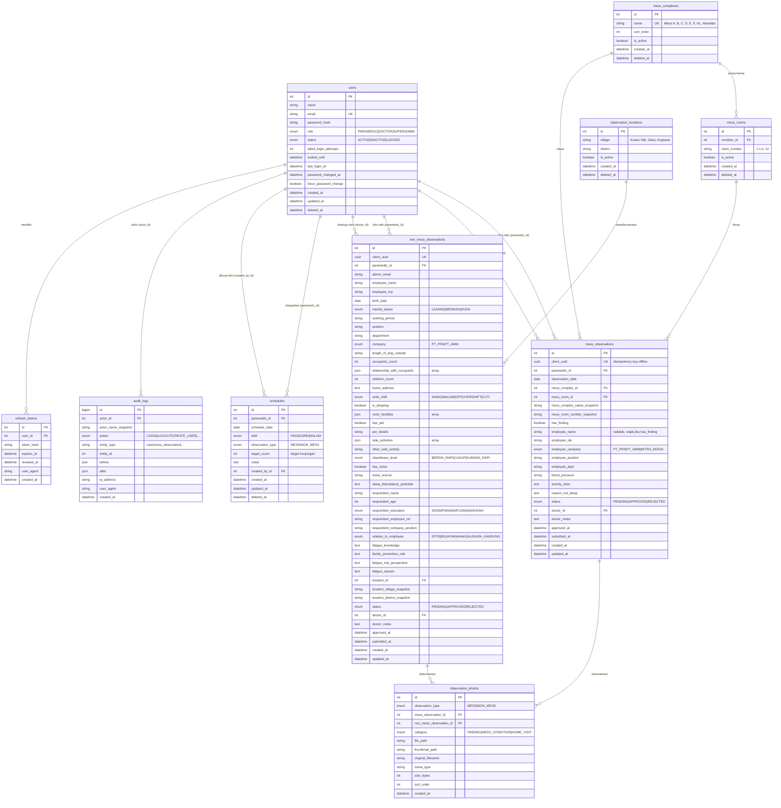

# 02 — Entity Relationship Diagram

> Model data konseptual. Detail tipe kolom, constraint, dan index ada di 03_DATABASE_SPEC.md.

---

## 1. Prinsip Pemodelan

1. **Tabel observasi dipisah** (`mess_observations` dan `non_mess_observations`). Kedua form punya ~9 dan ~35 field yang hampir tidak beririsan. Menggabungkannya menghasilkan satu tabel lebar dengan mayoritas kolom NULL, index yang tidak efisien, dan validasi kondisional yang rumit. Trade-off: query gabungan (riwayat, KPI, laporan) memerlukan `UNION`. Lihat ADR-001.
2. **Master data pakai soft delete.** Komplek dan kamar mess yang dihapus tetap dirujuk observasi lama. Kolom `deleted_at` menandai penghapusan logis.
3. **Denormalisasi terkendali.** Nama komplek & nomor kamar disalin ke tabel observasi (`mess_complex_name_snapshot`, `mess_room_number_snapshot`) agar laporan historis tidak berubah saat master data di-rename.
4. **Audit log satu tabel polimorfik.** `entity_type` + `entity_id` tanpa foreign key, karena merujuk banyak tabel dan harus tetap ada meski record aslinya dihapus.
5. **Foto dipisah ke tabel sendiri** (`observation_photos`). Form Non-Mess mendukung multi-foto, dan form Mess bisa berkembang ke multi-foto. Menyimpan URL sebagai kolom string tunggal akan cepat usang. Lihat ADR-002.

---

## 2. Diagram



---

## 3. Penjelasan Entitas

### users
Satu tabel untuk ketiga role. Role disimpan sebagai enum tunggal, bukan tabel `roles` terpisah, karena jumlahnya tetap tiga dan tidak ada kebutuhan permission granular per pengguna (matriks izin ditentukan di kode, lihat 10_BUSINESS_RULE.md). Soft delete via `deleted_at` agar email lama tidak bisa langsung dipakai ulang dan audit log tetap konsisten.

### refresh_tokens
Dipisah dari `users` (bukan kolom `refresh_token_hash` tunggal seperti PRD awal) agar satu pengguna bisa login di beberapa perangkat sekaligus — realistis untuk paramedis yang ganti ponsel. Memungkinkan pencabutan sesi per perangkat. Lihat ADR-004.

### mess_complexes & mess_rooms
Master data dua tingkat. Nomor kamar disimpan sebagai string, bukan integer, agar mendukung format seperti "12A" di kemudian hari. Unik per komplek: `(complex_id, room_number)`.

### mess_observations
Satu baris = satu kunjungan sidak ke satu kamar mess pada satu tanggal. Field karyawan (`employee_*`, `blood_pressure`, `activity_desc`, `reason_not_sleep`) nullable di level database, tapi **wajib di level aplikasi** ketika `has_finding = true`. Validasi kondisional ditegakkan di DTO backend dan skema Zod frontend, bukan di constraint DB, agar pesan error bisa spesifik per field.

### non_mess_observations
Satu baris = satu kunjungan rumah. Menggabungkan tiga bagian form (identitas & kondisi rumah, kuesioner keluarga, dokumentasi) dalam satu tabel karena selalu diisi bersamaan dan tidak pernah berdiri sendiri. Field multi-pilih (`room_facilities`, `side_activities`, `relationship_with_occupants`) disimpan sebagai JSON array — nilai pilihannya tetap dan tidak perlu dicari secara relasional.

### observation_photos
Tabel foto bersama untuk kedua tipe observasi. Menggunakan dua kolom FK nullable (`mess_observation_id`, `non_mess_observation_id`) dengan CHECK constraint bahwa tepat satu terisi. Alternatif tabel terpisah per tipe ditolak karena logika upload, kompresi, dan penghapusan file identik.

Kategori foto:
- `FINDING` — foto temuan pelanggaran (form Mess, saat `has_finding = true`)
- `MESS_CONDITION` — foto kondisi mess tertib (form Mess, saat `has_finding = false`)
- `HOME_VISIT` — foto dokumentasi kunjungan rumah (form Non-Mess, boleh banyak)

### observation_locations
Master desa & kecamatan untuk observasi Non-Mess. Dipisah menjadi tabel agar Superadmin bisa menambah lokasi baru tanpa deploy ulang, dan agar laporan bisa diagregasi per wilayah.

### schedules
Jadwal penugasan paramedis. Menjadi **denominator** perhitungan kepatuhan KPI. `target_count` memungkinkan satu jadwal mewakili beberapa kunjungan (misal: 5 kamar dalam satu shift).

### audit_logs
Append-only. Tidak pernah di-UPDATE atau DELETE. `actor_name_snapshot` menyimpan nama pada saat aksi terjadi, sehingga log tetap terbaca meski pengguna sudah dihapus. `before`/`after` menyimpan diff JSON untuk aksi perubahan data.

---

## 4. Kardinalitas

| Relasi | Kardinalitas | Aturan penghapusan |
|---|---|---|
| users → mess_observations (paramedic) | 1 : N | RESTRICT — pengguna dengan observasi tidak bisa dihapus |
| users → mess_observations (doctor) | 1 : N | SET NULL — observasi tetap ada meski akun dokter hilang |
| users → non_mess_observations (paramedic) | 1 : N | RESTRICT |
| users → non_mess_observations (doctor) | 1 : N | SET NULL |
| users → schedules | 1 : N | RESTRICT |
| users → refresh_tokens | 1 : N | CASCADE |
| users → audit_logs | 1 : N | SET NULL (tanpa FK constraint) |
| mess_complexes → mess_rooms | 1 : N | RESTRICT (soft delete saja) |
| mess_complexes → mess_observations | 1 : N | RESTRICT |
| mess_rooms → mess_observations | 1 : N | RESTRICT |
| mess_observations → observation_photos | 1 : N | CASCADE |
| non_mess_observations → observation_photos | 1 : N | CASCADE |
| observation_locations → non_mess_observations | 1 : N | RESTRICT |

---

## 5. Index yang Direncanakan

Index dipilih berdasarkan query nyata di 04_API_CONTRACT.md, bukan ditebak.

| Tabel | Index | Query yang dilayani |
|---|---|---|
| `users` | `email` (unique, partial `WHERE deleted_at IS NULL`) | Login, cek keunikan email |
| `users` | `(role, status)` | Daftar pengguna terfilter, dropdown pilih paramedis |
| `refresh_tokens` | `token_hash` (unique) | Validasi refresh |
| `refresh_tokens` | `(user_id, revoked_at)` | Cabut semua sesi pengguna |
| `mess_observations` | `client_uuid` (unique) | Idempotency sinkronisasi offline |
| `mess_observations` | `(status, created_at)` | Antrean approval dokter (urut terlama) |
| `mess_observations` | `(paramedic_id, observation_date DESC)` | Riwayat paramedis |
| `mess_observations` | `(observation_date, status)` | Laporan & KPI per rentang tanggal |
| `mess_observations` | `(mess_complex_id, observation_date)` | Laporan per komplek |
| `non_mess_observations` | `client_uuid` (unique) | Idempotency |
| `non_mess_observations` | `(status, created_at)` | Antrean approval |
| `non_mess_observations` | `(paramedic_id, created_at DESC)` | Riwayat paramedis |
| `non_mess_observations` | `(location_id, created_at)` | Laporan per wilayah |
| `observation_photos` | `mess_observation_id` | Ambil foto saat buka detail |
| `observation_photos` | `non_mess_observation_id` | Ambil foto saat buka detail |
| `mess_rooms` | `(complex_id, room_number)` (unique partial) | Cegah duplikat kamar |
| `schedules` | `(paramedic_id, schedule_date)` | Jadwal harian paramedis, denominator KPI |
| `schedules` | `(schedule_date, observation_type)` | Kalender jadwal semua paramedis |
| `audit_logs` | `(entity_type, entity_id, created_at DESC)` | Riwayat perubahan satu record |
| `audit_logs` | `(actor_id, created_at DESC)` | Aktivitas satu pengguna |

---

## 6. Catatan Query Gabungan

Riwayat observasi, KPI, dan laporan perlu menggabungkan dua tabel observasi. Pendekatan yang dipakai:

**Untuk daftar (paginated):** buat database VIEW `v_observations_summary` yang meng-`UNION ALL` kolom umum dari kedua tabel:

```
id, type, client_uuid, paramedic_id, observation_date,
subject_label, status, doctor_id, approved_at, created_at
```

`subject_label` diisi dari `mess_complex_name_snapshot + ' / ' + mess_room_number_snapshot` untuk MESS, dan `employee_name` untuk NON_MESS. View ini yang dipaginasi dan difilter; detail lengkap diambil dari tabel aslinya saat pengguna membuka satu record.

**Untuk KPI dan agregasi:** query agregat terpisah per tabel lalu digabung di layer service. Lebih mudah dibaca dan dioptimasi daripada UNION dengan GROUP BY berlapis.
